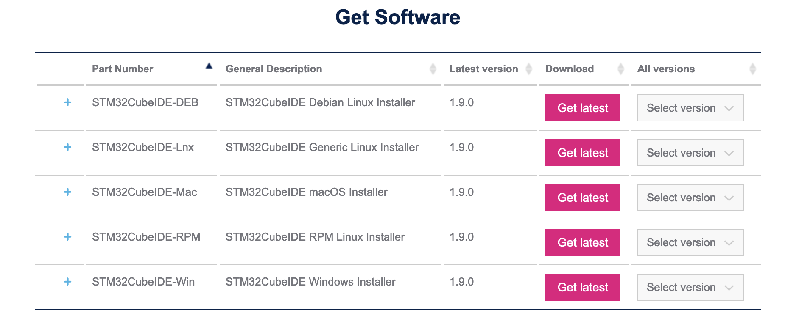

# Chapter 1: Installing and setup

We will use STM32CubeIDE to program the board. This guide provides information on how to install and setup the IDE and get the necessary libraries.

## What is STM32CubeIDE?

STM32CubeIDE is an IDE (Integrated Development Environment) for the STM32 microcontrollers. It is a software application that makes it easier to program your STM32 microcontrollers.

## How to install it?

Goto the software download page at: https://www.st.com/en/development-tools/stm32cubeide.html. Goto the "Get Software" section, and choose the version that suits your operating system.

 
    

