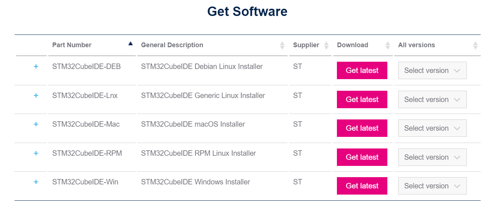
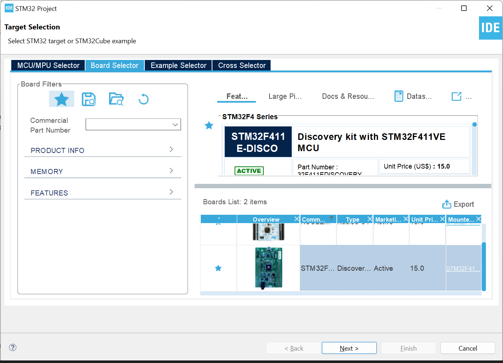
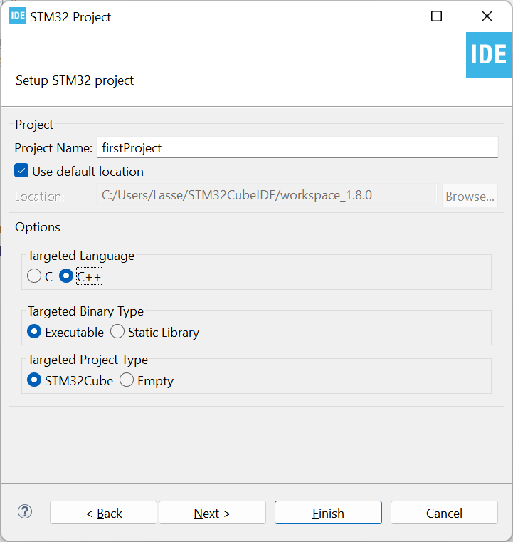
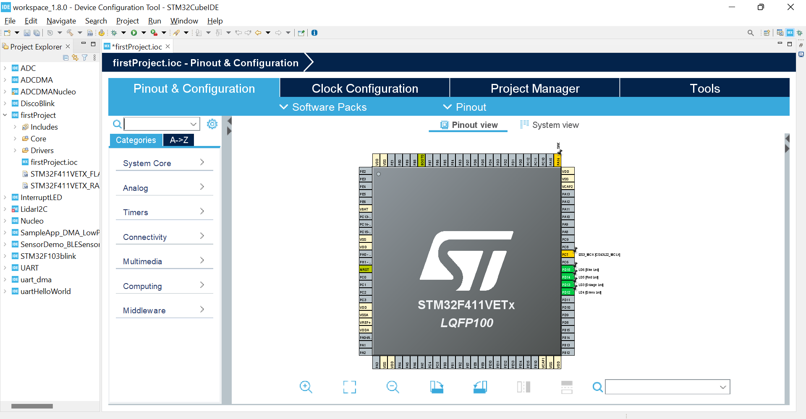
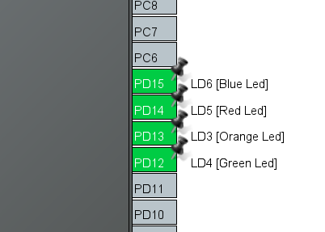
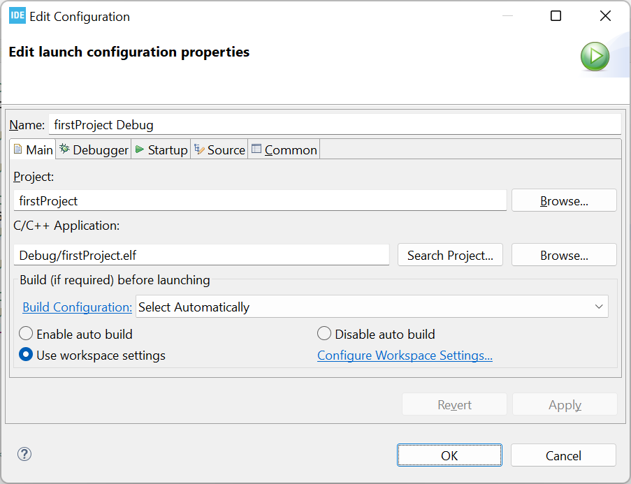
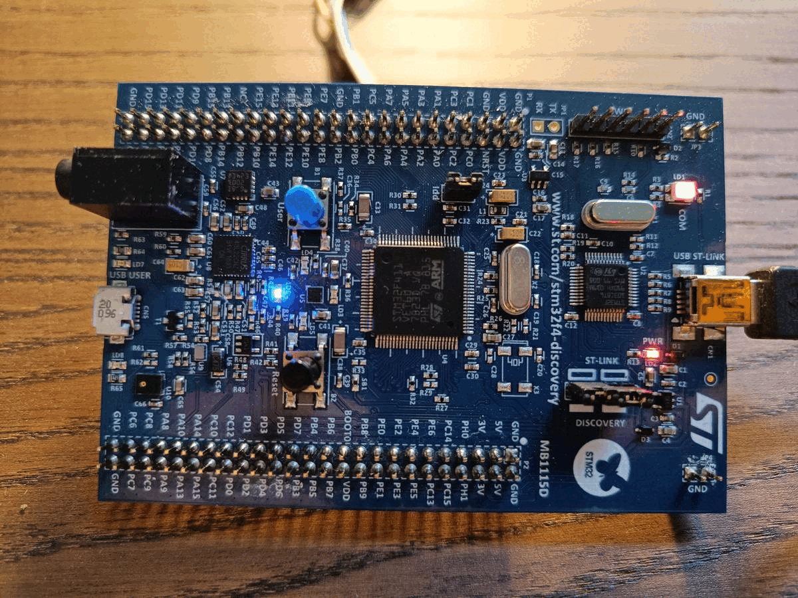

# Chapter 1: Installing and setup

We will use STM32CubeIDE to program the STM32 boards. This guide provides information on how to install and setup the IDE and the necessary libraries.

## What is STM32CubeIDE

STM32CubeIDE is an IDE (Integrated Development Environment) for the STM32 microcontrollers. It is a software application that makes it easier to program your STM32 microcontrollers. 

## How to install it?

Go to the software download page at: https://www.st.com/en/development-tools/stm32cubeide.html.

and download the installer for your system.
<p align="center"> 
    
</p>

Run the installer and use the default settings.

## Create your first STM32 Project
In the top left corner, click on File → New → STM32 Project  

<p align="center"> 
    
</p>

Go to the Board Selector Tab and search for your specific board. Since you probably are going to be using the board for other projects we recommend that you mark the board as a favorite to find it faster next time. 


<p align="center"> 
    
</p>

Name your project and click finish. Wait a few seconds for your IDE to setup the project file.


<p align="center"> 
    
</p>


## Introduction to use the STM32CubeIDE
The Basic concept of the IDE is that you have an *.ioc* project file where you see the pinout of the microcontroller. It is in this view you can click on the different pins and specify how they should be configured. Once you have specified the pin configurations in the *.ioc* file, the IDE automatically generates a *main.c* file that initializes the microcontroller based on the configurations specified in the *.ioc* file. This is done by pressing the hammer icon. If you cannot press build make sure you have saved the project file first. 

To get the most out of the IDE try to do as much as possible in the *.ioc* file since this will automatically update your *main.c* file with the configurations you have specified every time you press the build (hammer) icon. 


## Writing Custom Code in the *main.c* File

The autogenerated *main.c* file has different sections. Since the main file is automatically updated based on the configurations specified in the *.ioc* file there are some sections of the main file that will be overwritten every time you build your project. It is therefore very important that you write your custom code in the sections embraced by USER CODE BEGIN  and USER CODE END since everything that is outside the user code specified area will be overwritten.

```
    // This will be removed when building

    /* USER CODE BEGIN  */

    // Here you can write your custom code

    /* USER CODE END */

    // This will be removed when building
```


## Make the LED Blink

Make sure the LED pins properly configured as GPIO OUTPUT and press build.

<p align="center"> 
    
</p>

In the *main.c* file go to the infinite loop section and go to the user code section. Here you can use the Hardware Abstraction Layer (HAL) to get access to some functions. 

When writing HAL_ you can press ctrl + space to get suggestions. For this simple project we use the HAL_GPIO_TogglePin() function and in the inputs of the function you can also press ctrl + space to get suggestions to inputs. This is extremely helpful as it can be difficult to remember the names of the different functions and variables.

next we make a delay of 500 milli seconds by using the function HAL_Delay()

```

  /* Infinite loop */
  /* USER CODE BEGIN WHILE */
  while (1)
  {
	  
	  
	  HAL_GPIO_TogglePin(LD6_GPIO_Port, LD6_Pin);
	  HAL_Delay(500);
	  
	  
    /* USER CODE END WHILE */

    /* USER CODE BEGIN 3 */
  }
  /* USER CODE END 3 */

```
 Now you can press the Run icon.

 <p align="center"> 
    
</p>

Press OK. Now the blue LED flashes every 500 milli seconds.



