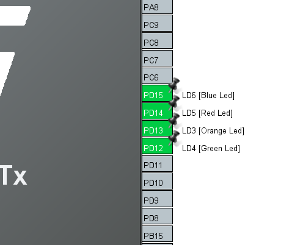
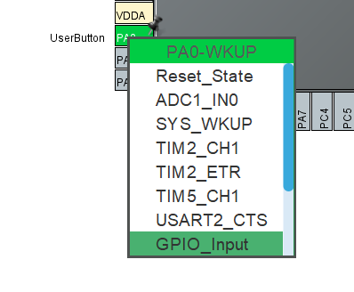
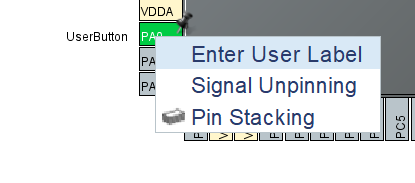
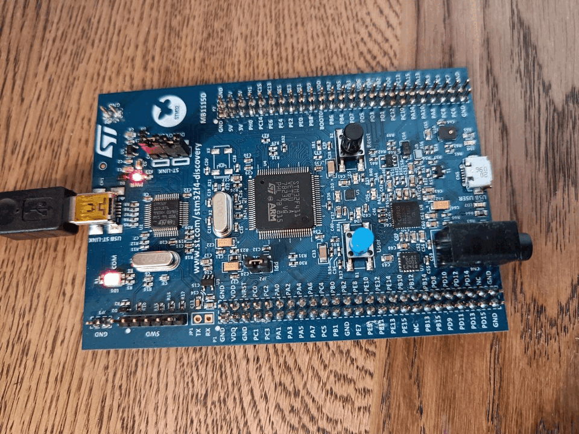

# GPIO - General Purpose Input Output - and Custom Functions

Microcontrollers are excellent for controlling sensors and actuators. Many of the pins of the microcontroller can be configured to be input or output. In this tutorial we will setup a Discovery board 


Start by generating a new STM32 Project file. We will configure the LED pins (PD12, PD13, PD14, PD15) of the Discovery Board to GPIO OUTPUT since we would like to control whether or not they are turned on. We will use the User Button (PA0) to control the LEDs we will thus configure it as a GPIO Input

<p align="center"> 
    
</p>

<p align="center"> 
    
</p>


You can make a custom label to your pins by right clicking on the desired pin and select Enter User Label. This will make it easier to find the pin later since you can search for your custom label in the *main.c* file by pressing ctrl + space.
<p align="center"> 
    
</p>

In the *main.c* file we add these lines of code to turn on the LEDs when the button is pressed and turn them off when the button is not pressed.

We do this by checking the state of the UserButton and if it is 
```
  /* Infinite loop */
  /* USER CODE BEGIN WHILE */
  while (1)
  {

// Check if the User button is pressed
	  if(HAL_GPIO_ReadPin(UserButton_GPIO_Port, UserButton_Pin)==1){
		  
		  HAL_GPIO_WritePin(LD3_GPIO_Port, LD3_Pin, SET);
		  HAL_GPIO_WritePin(LD4_GPIO_Port, LD4_Pin, SET);
		  HAL_GPIO_WritePin(LD5_GPIO_Port, LD5_Pin, SET);
		  HAL_GPIO_WritePin(LD6_GPIO_Port, LD6_Pin, SET);

	  }else{
		  // If the User button is not pressed
		  HAL_GPIO_WritePin(LD3_GPIO_Port, LD3_Pin, RESET);
		  HAL_GPIO_WritePin(LD4_GPIO_Port, LD4_Pin, RESET);
		  HAL_GPIO_WritePin(LD5_GPIO_Port, LD5_Pin, RESET);
		  HAL_GPIO_WritePin(LD6_GPIO_Port, LD6_Pin, RESET);
	  }

    /* USER CODE END WHILE */

    /* USER CODE BEGIN 3 */
  }
```
Now the Button controls whether the LEDs are turned on or off. To tidy up our code, we can make functions that turn on or off and than call the functions in the main loop.


```
/* Private user code ---------------------------------------------------------*/
/* USER CODE BEGIN 0 */
void turnOffLEDs(){
	  HAL_GPIO_WritePin(LD3_GPIO_Port, LD3_Pin, RESET);
	  HAL_GPIO_WritePin(LD4_GPIO_Port, LD4_Pin, RESET);
	  HAL_GPIO_WritePin(LD5_GPIO_Port, LD5_Pin, RESET);
	  HAL_GPIO_WritePin(LD6_GPIO_Port, LD6_Pin, RESET);
}

void turnOnLEDs(){
	  HAL_GPIO_WritePin(LD3_GPIO_Port, LD3_Pin, SET);
	  HAL_GPIO_WritePin(LD4_GPIO_Port, LD4_Pin, SET);
	  HAL_GPIO_WritePin(LD5_GPIO_Port, LD5_Pin, SET);
	  HAL_GPIO_WritePin(LD6_GPIO_Port, LD6_Pin, SET);
}

/* USER CODE END 0 */

```
...

```
  /* Infinite loop */
  /* USER CODE BEGIN WHILE */
  while (1)
  {
	  if(HAL_GPIO_ReadPin(UserButton_GPIO_Port, UserButton_Pin)==1){
		  turnOnLEDs();
	  }else{
		  turnOffLEDs();
	  }
    /* USER CODE END WHILE */

    /* USER CODE BEGIN 3 */
  }
```
Effectively the code does the same however, the code can be easier to read if many different light configuration functions are to be used.



