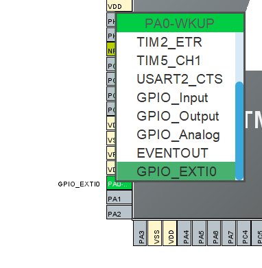
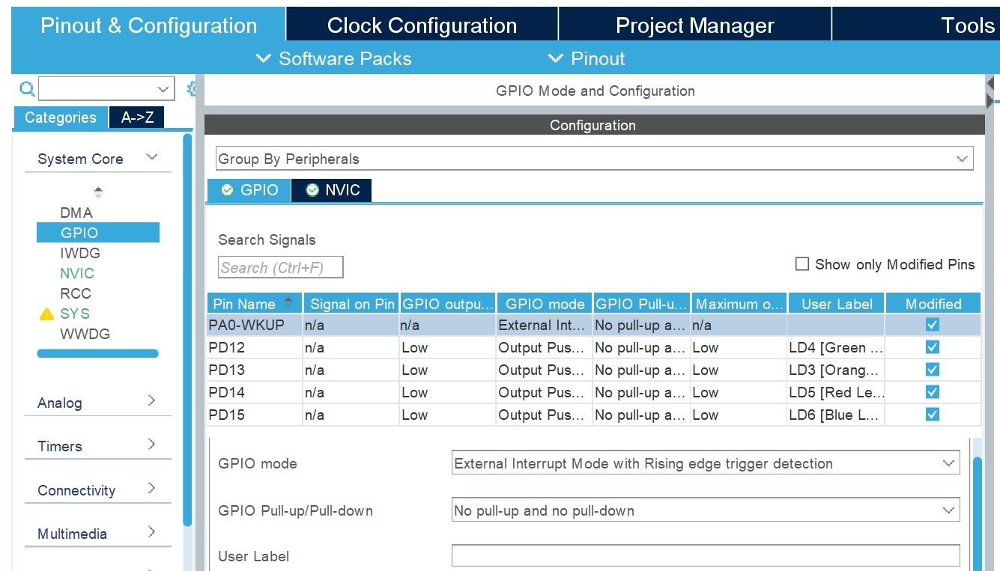
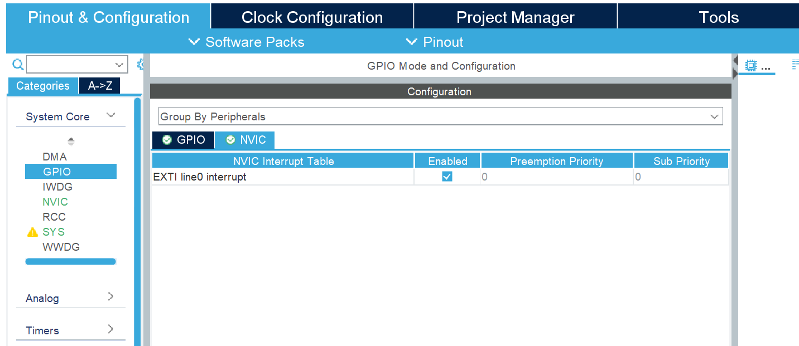
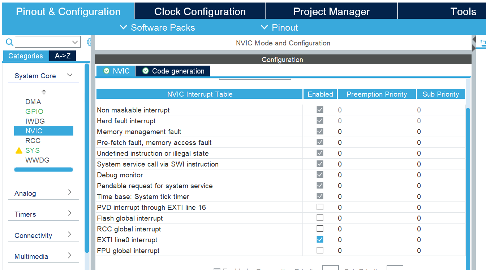
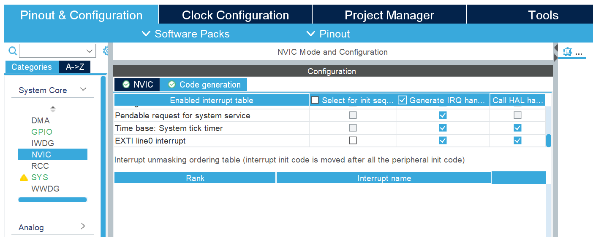

# Interrupts - a step towards non blocking code


## Why use Interrupts?
Interrupts can be very useful when programming microcontrollers since they can be used to check if a certain condition is met and as the word implies *interrupt* the infinite loop. In the interruption a state or a flag can be updated and the infinite loop continues where it left. This is very useful since it allows for a continous condition check instead of polling. There are generally two types of interrupts; 1 when a timer value reaches a specified value, 2 when an external trigger is either rising from logical 0 to logical 1, falling from logical 1 to logical 0 or both. In this project we will use the User Button as an external trigger.

## Setup GPIO External Interrupt 

Create a new STM32 Project File.

Since we will be using the User Button as the external interrupt we will configure PA0 to GPIO_EXTI0.
<p align="center"> 
    
</p>

In the System Core go to GPIO and set the mode to Rising edge trigger detection.

<p align="center"> 
    
</p>

Go to the NVIC tab and make sure it is Enabled
<p align="center"> 
    
</p>

In the System Core go to NVIC and make sure EXTI line0 interrupt is Enabled 


<p align="center"> 
    
</p>
Go to the Code generation Tab and make sure EXTI line0 interrupt has Generate IRQ handler and Call HAL checked

<p align="center"> 
    
</p>

If you want to have different priority levels you can assign it here. This can be useful if you have multiple interrupts. If for instance your car has an entertainment system and automatic braking when driving towards something. You want your braking system to have a higher priority than turning up the volume.

## Having Multiple LED Modes

In this code we will setup multiple light modes (*state*) that can be changed when clicking the user button. If we were to implement it like in the previous chapter we would run into a problem:
*If we press the button while we are in a delay the press would not be detected*.

 This is why we set up an interrupt that will pause the infinite loop and execute the code in the interrupt Callback function and then proceed with the infinite loop. 

 It is generally a good idea to keep the interrupt Callback as short as possible. This is why we in the Callback update the *state* value and then check the *state* value in the infinite loop.

*nModes* is the amount of different light modes

```c
/* Private variables ---------------------------------------------------------*/
/* USER CODE BEGIN PV */
  int state = 2;
  int nModes = 2;
  uint8_t first = 0;
/* USER CODE END PV */
```


*first* is used to initialize the light values. Everytime the button is pressed it is reset to 0 and the *state* is updated.

```c
/* Private user code ---------------------------------------------------------*/
/* USER CODE BEGIN 0 */
void HAL_GPIO_EXTI_Callback(uint16_t GPIO_Pin){
first = 0; // Reset counter
	if(state == nModes){
		state = 0;
	}else{
		state++;
	}
}
/* USER CODE END 0 */
```


```c
  /* Infinite loop */
  /* USER CODE BEGIN WHILE */
  while (1)
  {
	  switch (state){

	  case 0:

		  if(first == 0){
			  HAL_GPIO_WritePin(LD4_GPIO_Port, LD4_Pin,RESET);
			  HAL_GPIO_WritePin(LD5_GPIO_Port, LD5_Pin,RESET);
			  HAL_GPIO_WritePin(LD6_GPIO_Port, LD6_Pin,RESET);
			  first = 1;
		  }

		  HAL_GPIO_TogglePin(LD3_GPIO_Port, LD3_Pin);

		  HAL_Delay(500);
		  break;

	  case 1:
		  if(first == 0){
		  HAL_GPIO_WritePin(LD3_GPIO_Port, LD3_Pin, RESET);
		  first = 1;
		  }

		  HAL_GPIO_TogglePin(LD4_GPIO_Port, LD4_Pin);
		  HAL_GPIO_TogglePin(LD5_GPIO_Port, LD5_Pin);
		  HAL_GPIO_TogglePin(LD6_GPIO_Port, LD6_Pin);

		  HAL_Delay(100);
		  break;
	  case 2:
		  if(first == 0){
			  HAL_GPIO_WritePin(LD3_GPIO_Port, LD3_Pin,SET);
			  HAL_GPIO_WritePin(LD4_GPIO_Port, LD4_Pin,RESET);
			  HAL_GPIO_WritePin(LD5_GPIO_Port, LD5_Pin,SET);
			  HAL_GPIO_WritePin(LD6_GPIO_Port, LD6_Pin,RESET);
			  first = 1;
		  }

		  HAL_GPIO_TogglePin(LD3_GPIO_Port, LD3_Pin);
		  HAL_GPIO_TogglePin(LD4_GPIO_Port, LD4_Pin);
		  HAL_GPIO_TogglePin(LD5_GPIO_Port, LD5_Pin);
		  HAL_GPIO_TogglePin(LD6_GPIO_Port, LD6_Pin);


		  HAL_Delay(300);
		  break;
	  }

    /* USER CODE END WHILE */

    /* USER CODE BEGIN 3 */
  }
  ```

When pressing the button the light mode changes. Even if we press while we are in a delay. 


