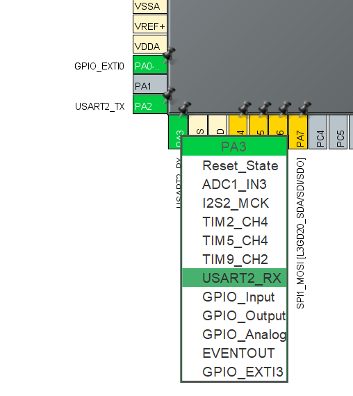

# UART - Hello World!

## Introduction
In this tutorial we will set up a UART communication for the STM32F411E-DISCO BOARD. UART is usefull for communicating between microcontroller and a computer. Using UART communication can be helpful when troubleshooting. It can also be as communication between microcontrollers.

## Hardware Setup
We experienced some trouble using the ST-Link as a UART so we had to connect an external TTL to USB adaptor. We connected GND, TX and RX of the adaptor to GND, PA3, and PA2 respectively of the Discovery board.

<p align="center"> 
    
</p>


## STM32Cube IDE Setup

- Create a new STM32 Project
- Select the STM32F411E-DISCO BOARD
- In the Pinout view click on pin PA3 and select USART2_RX
- In the Pinout view click on pin PA2 and select USART2_TX
<p align="center"> 
    
</p>
- In the Pinout & Configurations tab select connectivity and click on USART2. Here you can select the Mode to Asynchronous
<p align="center"> 
    
</p>

- Now you can save the file and press the Build icon
- In the main.c file you can include the string.h and stdio.h files. 

```
/* Includes ------------------------------------------------------------------*/
#include "main.h"

/* Private includes ----------------------------------------------------------*/
/* USER CODE BEGIN Includes */
#include "string.h"
#include "stdio.h"
/* USER CODE END Includes */
```

- In the infinite loop create a char value that you assign to the string you want to send to your PC. Use the HAL function to transmit your string. 

```
  while (1)
  {
	  char msg[] = "Hello World! \n";

	  HAL_UART_Transmit(&huart2, (uint8_t*)msg, strlen(msg), HAL_MAX_DELAY);
	  HAL_Delay(500);
    /* USER CODE END WHILE */

    /* USER CODE BEGIN 3 */
  }
```
- Upload the code to your DISCO BOARD by pressing the Run button
- Once the code has been built successfully you can open up your Serial Capture program. We use RealTerm. Set the Baud rate to the same as your DISCO Board and select the proper COM PORT. If you are using line breaks in your string you have to enable that in the Display tab in RealTerm.

<p align="center"> 
    
</p>


