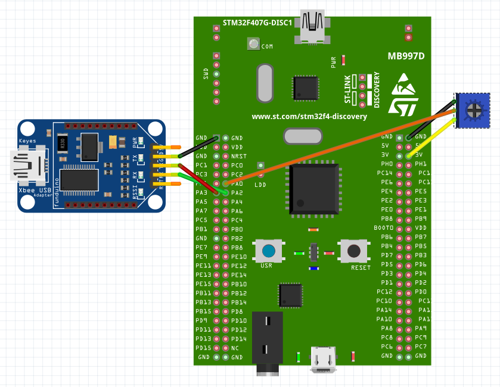
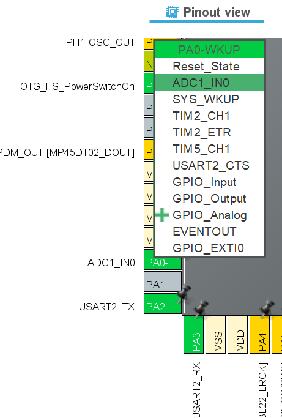
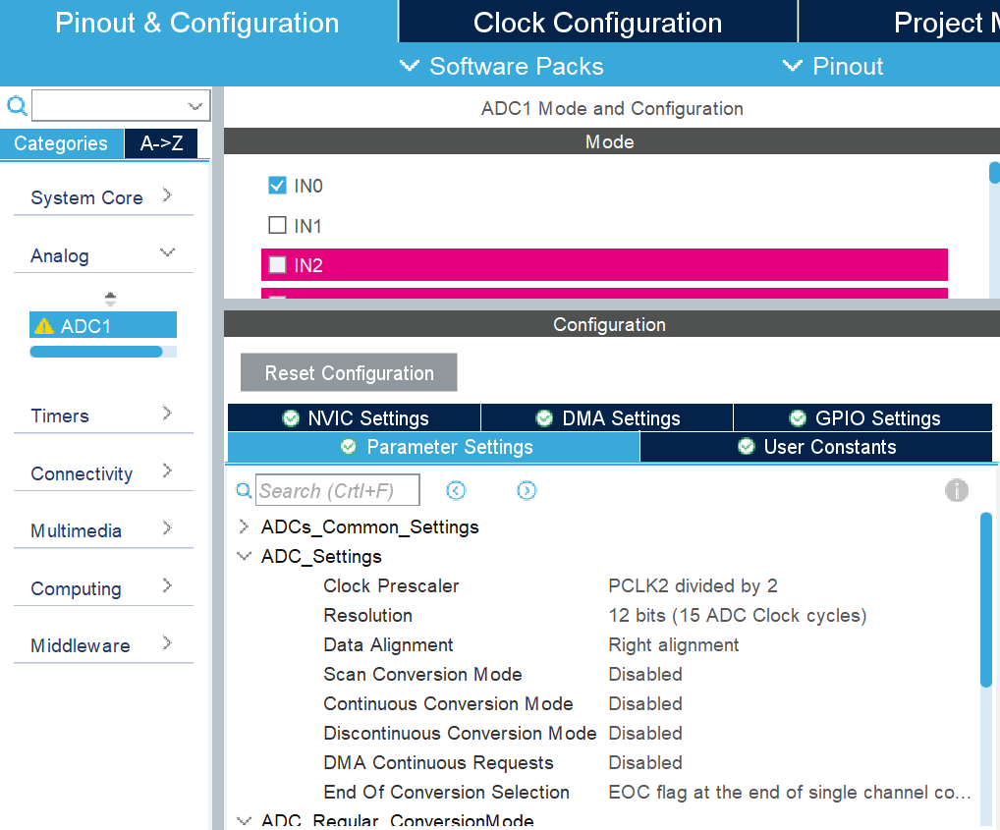
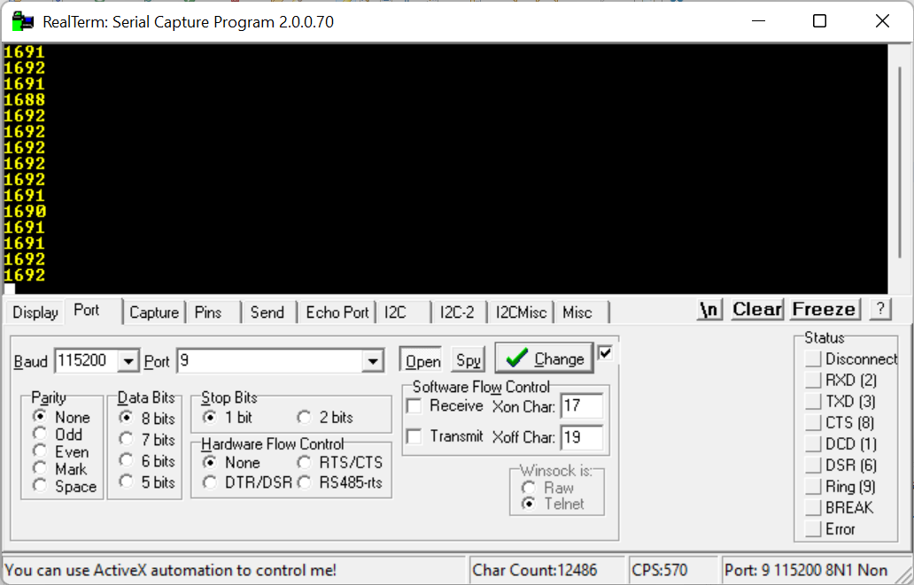

# ADC - Analog to Digital Conversion

## Introduction

<!--   

* ADC bit level
Reading different voltage levels and converting it into an integer value corresponding to the voltage.
The higher the number of bits the better the resolution will be. Pulling a value 


Using DMA in combination to access the ADC continously instead of using CPU to handle the reading.


   -->


## Hardware Setup
<p align="center"> 
    
</p>

## STM32Cube IDE Setup
- Create a new STM32 Project
- Select the STM32F411E-DISCO BOARD
- We will setup the UART so we can display the analog values.
- In the Pinout view click on pin PA3 and select USART2_RX
- In the Pinout view click on pin PA2 and select USART2_TX
<p align="center"> 
    
</p>
- In the Pinout & Configurations tab select connectivity and click on USART2. Here you can select the Mode to Asynchronous
<p align="center"> 
    
</p>

### Setting up the ADC
There are many GPIO pins on the Discovery Board that can be configured to be ADC. In this tutorial we will configure PA0 to read the analog signal.

- In the Pinout view click on pin PA0 and select ADC1_IN0

<p align="center"> 
    
</p>

- In the Pinout & Configurations tab go to Analog --> make a tick infront of IN0 
<p align="center"> 
    
</p>

- It is important to start the ADC otherwise it will not work.

```
 /* Infinite loop */
  /* USER CODE BEGIN WHILE */
  while (1)
  {
	  // start the ADC
	  HAL_ADC_Start(&hadc1);
	  uint16_t raw = HAL_ADC_GetValue(&hadc1);
	  
	  // Create a message to transmit the analog Value
	  char msg[10];
	  sprintf(msg, "%hu\r\n",raw);
	  // Transmitting the value
	  HAL_UART_Transmit(&huart2, (uint8_t*)msg, strlen(msg), HAL_MAX_DELAY);
	  HAL_Delay(10);

    /* USER CODE END WHILE */

    /* USER CODE BEGIN 3 */
  }
  ```
You can now open your serial monitor and the ADC values are shown.

<p align="center">
    
</p>
