# BLE - Bluetooth mobile communcation

## Introduction
In this tutorial we will explain how to use BLE together with a phone to send and receive data.

## Requirements
- A Nucleo board (We are using STM32F411RE)
- BLE shield (We are using X-NUCLEO-IDB05A2)
- An Android Phone (Optional)
- STM32CubeIDE together with X-Cube-BLE-1 Software expansion pack

## Hardware Setup
You need to attach the shield to the nucleo controller. If you are using your android phone to run the app from Android Studio, you need to attach it to your computer with a cable, enable developer mode on the phone, enable USB-debugging and allow file transfers between the computer and phone. No further setup is required 

## About BLE

Bluetooth Low Energy (Shortened BLE) is, as the name suggests, a more energyefficient version of traditional bluetooth. It saves energy mainly by going into a power saving mode: it only establishes a connection lasting a few miliseconds when it needs to transfer data, contrary to traditional bluetooth where connections can last from seconds to hours. We will not go into too much detail about the technical aspects of how BLE works, but there is one important takeaway, which is how BLE transfers data. It uses what is called GATT (The Generic Attribute Profile) which describes the structure of the data being sent. So the data being sent concists of one or multiple of what is called "services" and each service has what is called "characteristics", which can contain one or more data values. A service could for example be "WeatherService" and have a characteristic called "LightSensors" with two values, one for UV light level and one for brightness level and another characteristic called "TemperatureSensors" with a value for the temperature. 

## Tutorial

We will make use of the example code provided by ST for the X-Cube-BLE1 library. We will then take a look at how the example code works and how we can modify it. The example code provides all of the functionality to setup a BLE service and characteristics and connect with a phone. 

### Code and software setup

You first need to install X-Cube-BLE-1 software expansion pack for STM32CubeIDE if you have not already installed it. You can choose select software packs from the dropdown menu called Software Packs. See image below.

<p align="center"> 
    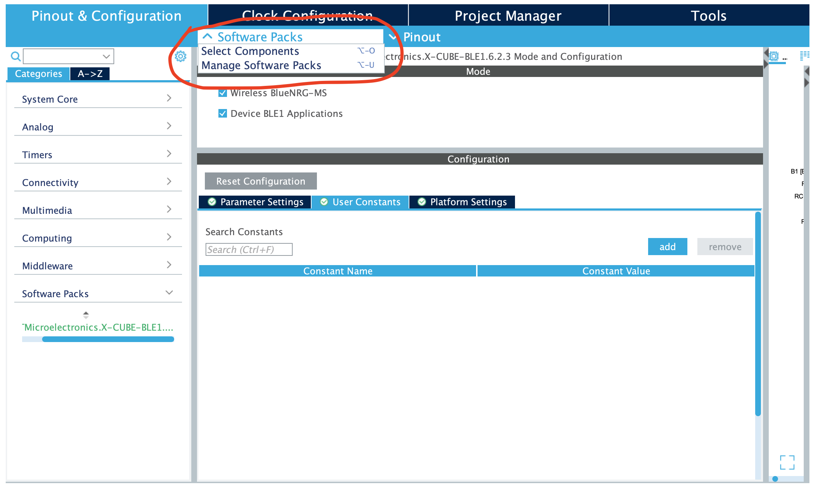
</p>

You can then choose to install X-Cube-BLE-1. If you can't find it on this page, you can instead download the software from ST, available at https://www.st.com/en/embedded-software/x-cube-ble1.html. Then you can choose manage software packs, add from local url and then import the zip file that you downloaded. Next you need to setup the configuration correctly for the software package. We are using SensorDemoBLE as our application, for HCI_TL we are using Basic and for HCI_TL_INTERFACE we are using UserBoard.

<p align="center"> 
    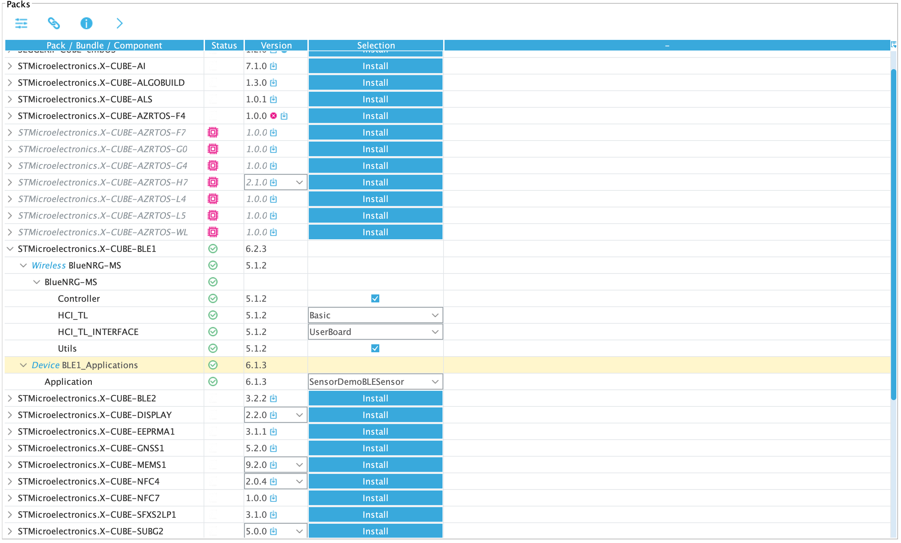
</p>

We then need to correctly configure the pins on our micro controller. These settings are specific to the micro controller we are using (F411), but should be easily applicable to any nucleo board. Without going into too much detail the layout is visible from the image below.

<p align="center"> 
    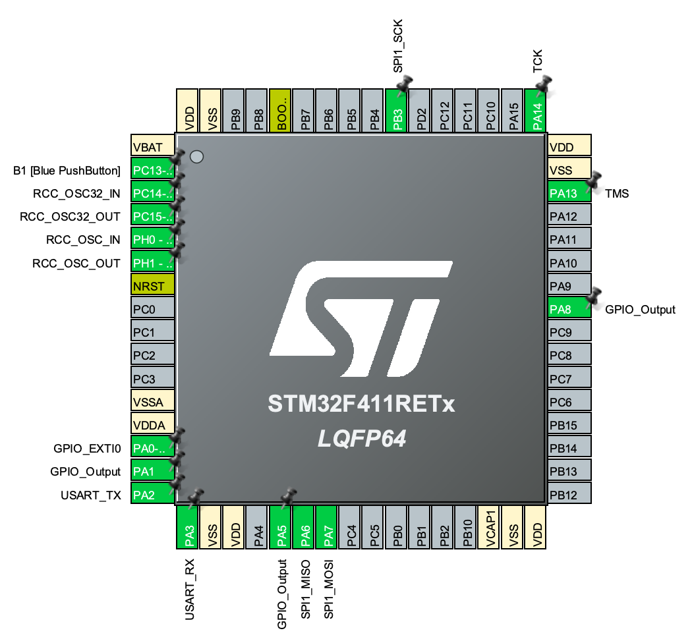
</p>

Then make sure that the USART and SPI are configured correctly for the BLE to work. You want USART as Asynchronous and SPI set to Full-Duplex Master.

<p align="center"> 
    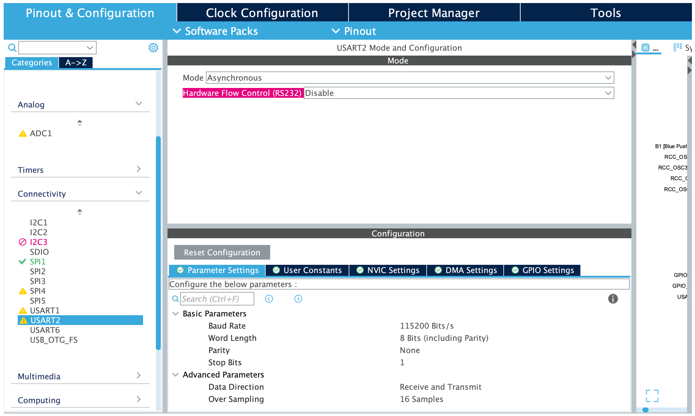
</p>
<p align="center"> 
    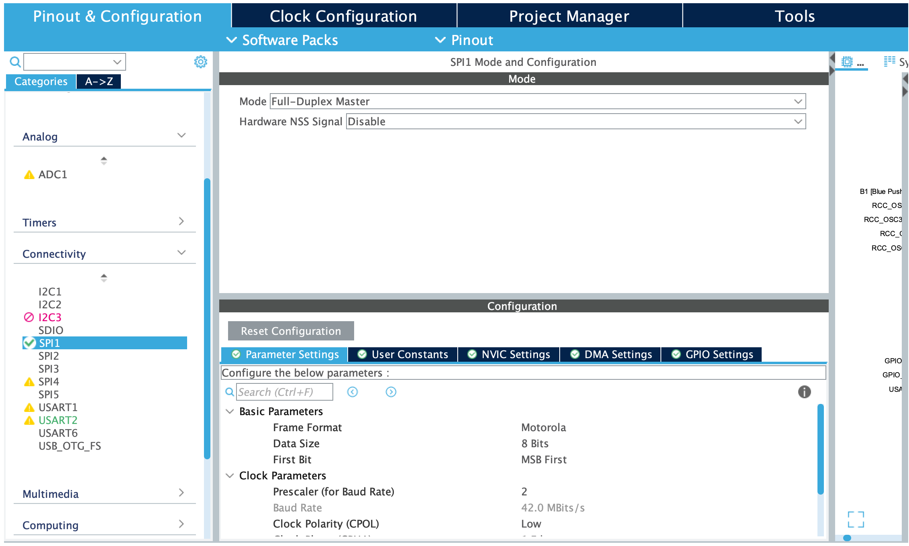
</p>

Next goto settings for the software expansion X-Cube-BLE1 that you just installed located under software packs, in the left menu. Then select platform settings and set the values as they are given from the image. You might have different values depending on your pin configuration, but just make sure that all settings are set.

<p align="center"> 
    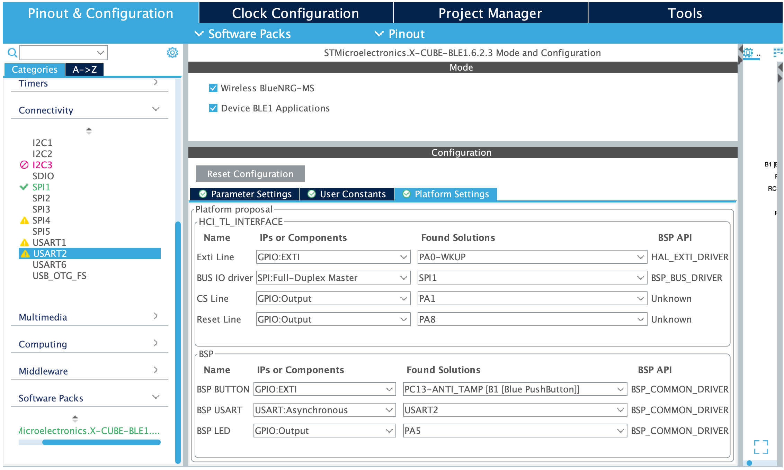
</p>

You can also adjust the parameter settings, but this is optional. We set BLE1_DEBUG to "Only User messages are shown (1)", to recieve debug messages, that can be helpful to ensure that everything is working correctly.

<p align="center"> 
    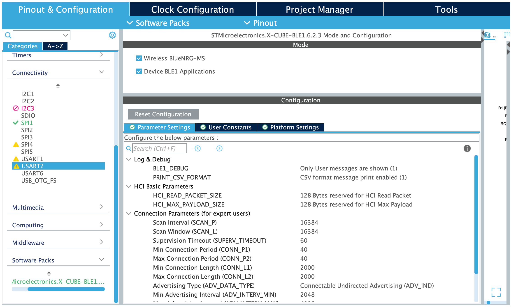
</p>

A important step is to enable interrupts. In the left most menu under System Core, choose GPIO. Under GPIO choose NVIC and make sure that "EXTI line0 interrupt" is enabled. 

<p align="center"> 
    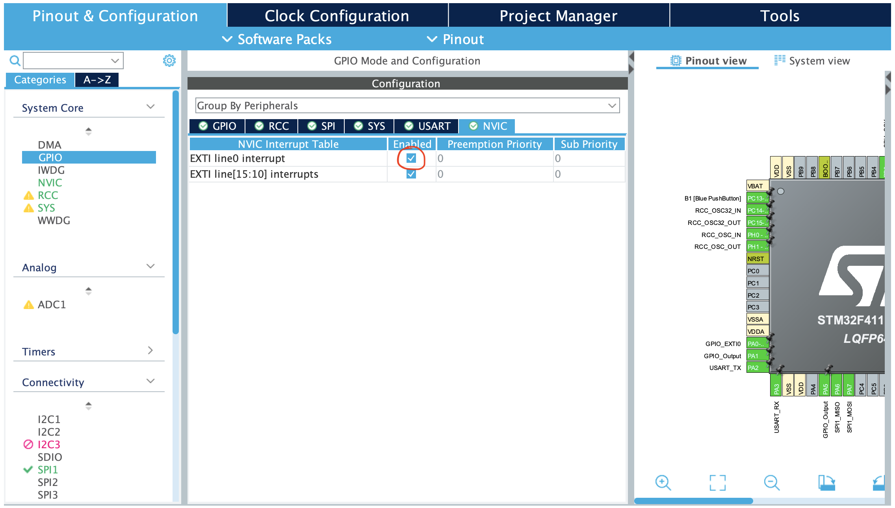
</p>

Next choose NVIC under System Core and make sure that "EXTI line0 interrupt" is enabled here as well.

<p align="center"> 
    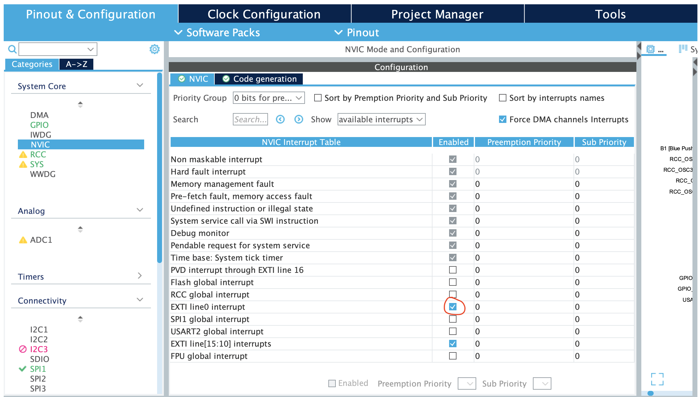
</p>

You should now be able to upload the code to the microcontroller.

### Mobile app setup

The app "ST BLE Sensor" is available for download on both google play and app store. You can download this app to test that the communication between your phone and the nucleo board is working. 

ST also provides the code for the app. However they seem to link to some github repositories as dependencies within the application without any version control. This makes it so that the current version of the app does not run out of the box, because the repositories are no longer compatible with the application code. We had to do a lot of modifications to make the app run. Therefore we recommend just using the app available in app store and google play.

If you have the app open, press "Connect one device". Your device should then show up.

<div style="display: flex; justify-content: center">
    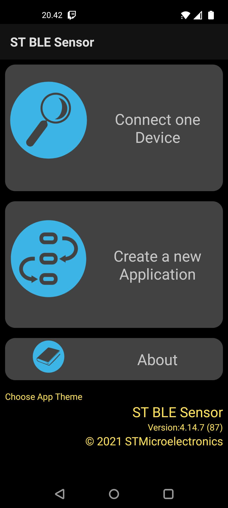
    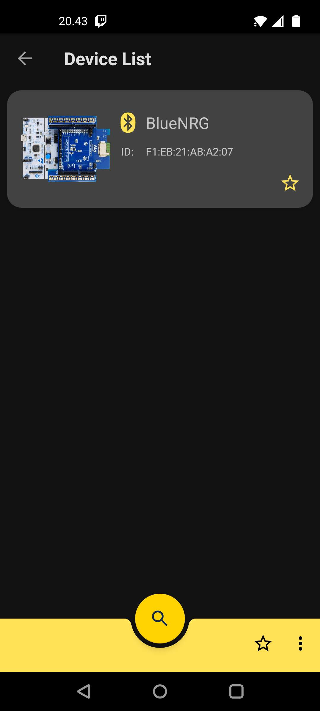
</div>

<div style="display: flex; justify-content: center">
    
    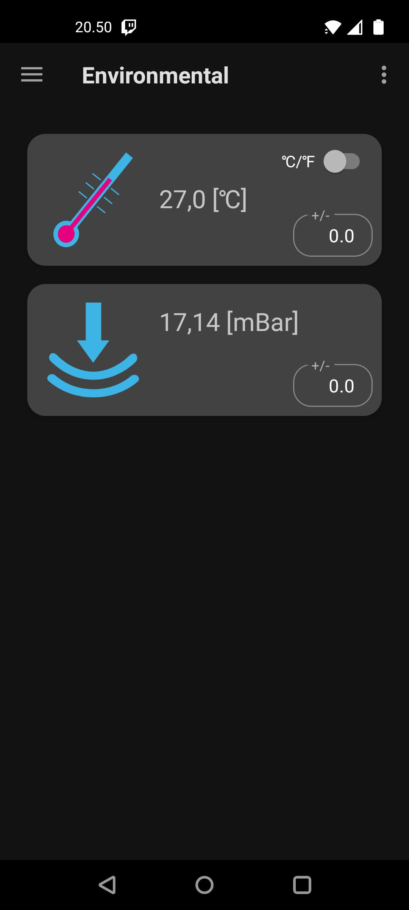
</div>


### Sending ECG data through BLE

We will now look at how we can transfer a uint32_t value using the example code. We could add a new service and characteristic for this purpose, but for simplicity we will use a already existing characterisitic and just change the pressure value that is being transfered. For our input we will add a ECG sensor to PB0, which corresponds to ADC_IN8. The sensor is shown below.

<p align="center"> 
    
</p>
 We put the electrodes in positions as seen in the image below.
<p align="center"> 
    
</p>


The example code has two function calls related to the BLE functionality in the main.c file. These function calls are to the functions "MX_BlueNRG_MS_Init" and "MX_BlueNRG_MS_Process". The init function is called to setup the BLE services and characteristics and make the controller visible and the process function is called repeatedly in the while loop and handles the syncronization of data between the controller and a connected device. The code for the main function is illustrated below.

```c
int main(void)
{
  /* USER CODE BEGIN 1 */

  /* USER CODE END 1 */

  /* MCU Configuration--------------------------------------------------------*/

  /* Reset of all peripherals, Initializes the Flash interface and the Systick. */
  HAL_Init();

  /* USER CODE BEGIN Init */

  /* USER CODE END Init */

  /* Configure the system clock */
  SystemClock_Config();

  /* USER CODE BEGIN SysInit */

  /* USER CODE END SysInit */

  /* Initialize all configured peripherals */
  MX_GPIO_Init();
  MX_BlueNRG_MS_Init();
  /* USER CODE BEGIN 2 */

  /* USER CODE END 2 */

  /* Infinite loop */
  /* USER CODE BEGIN WHILE */
  while (1)
  {
    /* USER CODE END WHILE */

  MX_BlueNRG_MS_Process();
    /* USER CODE BEGIN 3 */
  }
  /* USER CODE END 3 */
}
```

The function MX_BlueNRG_MS_Init is located in the file "BlueNRG_MS/App/app_bluenrg_ms.c". The code can be seen below.

```c
void MX_BlueNRG_MS_Init(void)
{
  /* USER CODE BEGIN SV */

  /* USER CODE END SV */

  /* USER CODE BEGIN BlueNRG_MS_Init_PreTreatment */

  /* USER CODE END BlueNRG_MS_Init_PreTreatment */

  /* Initialize the peripherals and the BLE Stack */
  const char *name = "BlueNRG";
  uint16_t service_handle, dev_name_char_handle, appearance_char_handle;

  uint8_t  bdaddr_len_out;
  uint8_t  hwVersion;
  uint16_t fwVersion;
  int ret;

  User_Init();

  /* Get the User Button initial state */
  user_button_init_state = BSP_PB_GetState(BUTTON_KEY);

  hci_init(user_notify, NULL);

  /* get the BlueNRG HW and FW versions */
  getBlueNRGVersion(&hwVersion, &fwVersion);

  /*
   * Reset BlueNRG again otherwise we won't
   * be able to change its MAC address.
   * aci_hal_write_config_data() must be the first
   * command after reset otherwise it will fail.
   */
  hci_reset();
  HAL_Delay(100);

  PRINTF("HWver %d\nFWver %d\n", hwVersion, fwVersion);
  if (hwVersion > 0x30) { /* X-NUCLEO-IDB05A1 expansion board is used */
    bnrg_expansion_board = IDB05A1;
  }

  ret = aci_hal_read_config_data(CONFIG_DATA_RANDOM_ADDRESS, BDADDR_SIZE, &bdaddr_len_out, bdaddr);

  if (ret) {
    PRINTF("Read Static Random address failed.\n");
  }

  if ((bdaddr[5] & 0xC0) != 0xC0) {
    PRINTF("Static Random address not well formed.\n");
    while(1);
  }

  /* GATT Init */
  ret = aci_gatt_init();
  if(ret){
    PRINTF("GATT_Init failed.\n");
  }

  /* GAP Init */
  if (bnrg_expansion_board == IDB05A1) {
    ret = aci_gap_init_IDB05A1(GAP_PERIPHERAL_ROLE_IDB05A1, 0, 0x07, &service_handle, &dev_name_char_handle, &appearance_char_handle);
  }
  else {
    ret = aci_gap_init_IDB04A1(GAP_PERIPHERAL_ROLE_IDB04A1, &service_handle, &dev_name_char_handle, &appearance_char_handle);
  }
  if (ret != BLE_STATUS_SUCCESS) {
    PRINTF("GAP_Init failed.\n");
  }

  /* Update device name */
  ret = aci_gatt_update_char_value(service_handle, dev_name_char_handle, 0,
                                   strlen(name), (uint8_t *)name);
  if (ret) {
    PRINTF("aci_gatt_update_char_value failed.\n");
    while(1);
  }

  ret = aci_gap_set_auth_requirement(MITM_PROTECTION_REQUIRED,
                                     OOB_AUTH_DATA_ABSENT,
                                     NULL,
                                     7,
                                     16,
                                     USE_FIXED_PIN_FOR_PAIRING,
                                     123456,
                                     BONDING);
  if (ret) {
    PRINTF("aci_gap_set_authentication_requirement failed.\n");
    while(1);
  }

  PRINTF("BLE Stack Initialized\n");

  ret = Add_HWServW2ST_Service();
  if(ret == BLE_STATUS_SUCCESS) {
    PRINTF("BlueMS HW service added successfully.\n");
  } else {
    PRINTF("Error while adding BlueMS HW service: 0x%02x\r\n", ret);
    while(1);
  }

  ret = Add_SWServW2ST_Service();
  if(ret == BLE_STATUS_SUCCESS) {
     PRINTF("BlueMS SW service added successfully.\n");
  } else {
     PRINTF("Error while adding BlueMS HW service: 0x%02x\r\n", ret);
     while(1);
  }

  /* Set output power level */
  ret = aci_hal_set_tx_power_level(1,4);

  /* USER CODE BEGIN BlueNRG_MS_Init_PostTreatment */

  /* USER CODE END BlueNRG_MS_Init_PostTreatment */
} 
```

Some things to notice that it does. It detects the software and hardware version of the expansion board and automatically detects which board is being used. It recognizes the board as IDB05A1, but this is fine, even though we are using IDB05A2. Then it reads a static random address from the board using the function "aci_hal_read_config_data". It is also possible to change the code to assign a public address, but we will not go into detail about how to do that in this tutorial. It then sets the device name using "aci_gatt_update_char_value" and sets auth requirements using "aci_gap_set_auth_requirement", where it is possible to specify a password to establish a connection to the device. It then adds the services along with their characteristics. 

The process code looks like this. 

```c
void MX_BlueNRG_MS_Process(void)
{
  /* USER CODE BEGIN BlueNRG_MS_Process_PreTreatment */

  /* USER CODE END BlueNRG_MS_Process_PreTreatment */

  User_Process();
  hci_user_evt_proc();

  /* USER CODE BEGIN BlueNRG_MS_Process_PostTreatment */

  /* USER CODE END BlueNRG_MS_Process_PostTreatment */
}
```

The function that we are interested in is "User_Process". Our modified version looks like this, where we have added a function call to "HAL_ADC_GetValue" given a global handle that we have defined in main.h as "extern ADC_HandleTypeDef globalHandleADC1". We have also adjusted the HAL_DELAY to 5 miliseconds.

```c
static void User_Process(void)
{
  float data_t;
  float data_p;
  static uint32_t counter = 0;

  if (set_connectable)
  {
    Set_DeviceConnectable();
    set_connectable = FALSE;
  }

#if USE_BUTTON
  /* Check if the user has pushed the button */
  if (user_button_pressed)
  {
    /* Debouncing */
    HAL_Delay(50);

    /* Wait until the User Button is released */
    while (BSP_PB_GetState(BUTTON_KEY) == !user_button_init_state);

    /* Debouncing */
    HAL_Delay(50);
#endif
    BSP_LED_Toggle(LED2);

    if (connected)
    {
      /* Set a random seed */
      srand(HAL_GetTick());

      /* Update emulated Environmental data */
      Set_Random_Environmental_Values(&data_t, &data_p);

      /* We get the raw input of our ECG sensor */
      uint32_t rawInput = HAL_ADC_GetValue(&globalHandleADC1);

      /* We pass the rawInput variable instead of data_p */
      BlueMS_Environmental_Update((int32_t)(rawInput), (int16_t)(data_t * 10));

      /* Update emulated Acceleration, Gyroscope and Sensor Fusion data */
      Set_Random_Motion_Values(counter);
      Acc_Update(&x_axes, &g_axes, &m_axes);
      Quat_Update(&q_axes);

      counter ++;
      if (counter == 40) {
        counter = 0;
        Reset_Motion_Values();
      }
#if !USE_BUTTON
      HAL_Delay(5); /* wait 0.005 sec before sending new data */
#endif
    }
#if USE_BUTTON
    /* Reset the User Button flag */
    user_button_pressed = 0;
  }
#endif
}
```


