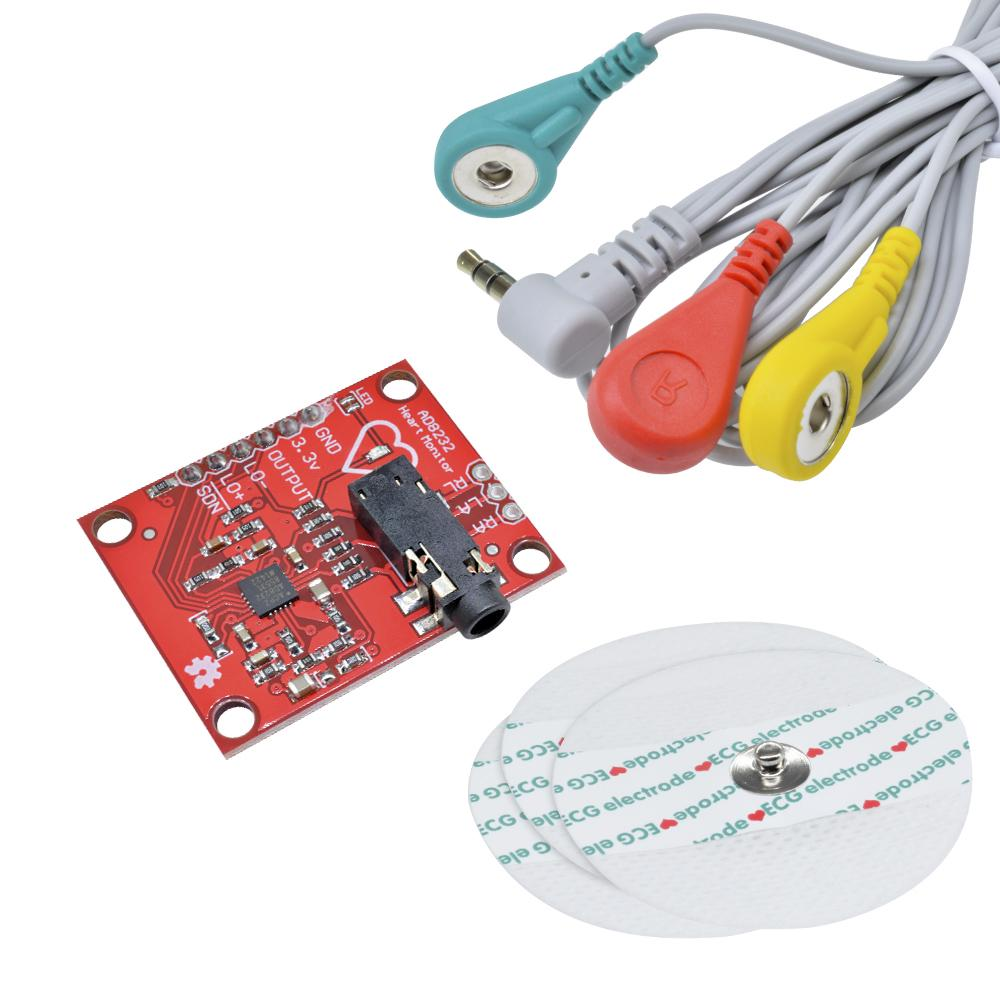
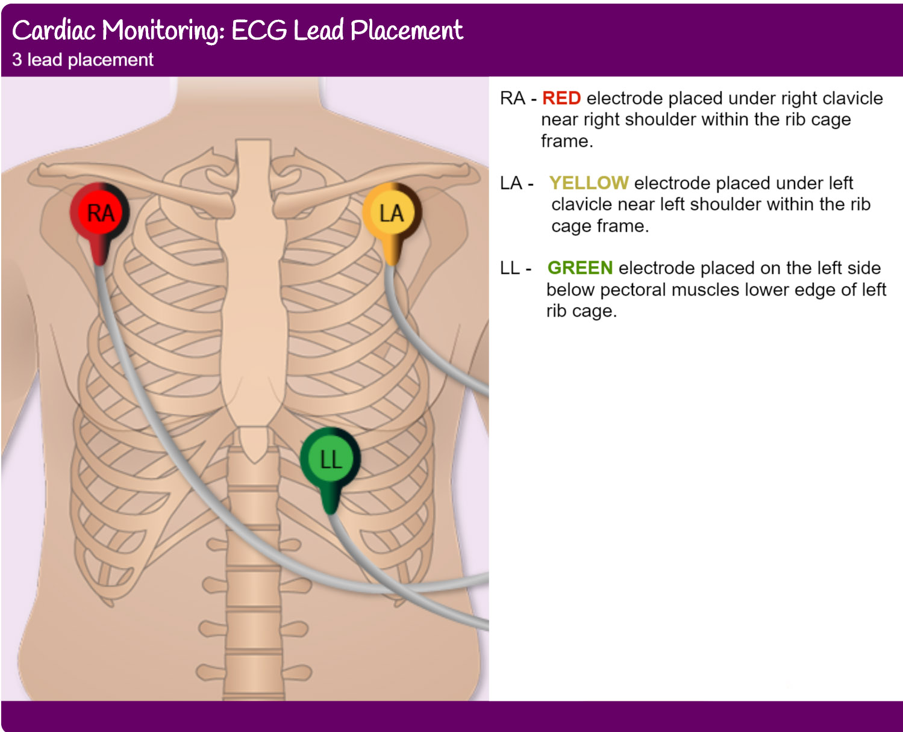

## To Do List

We do have some things to do

## Chapters to write

- [X] Installing
- [X] GPIO
- [X] Interrupt
- [x] UART
- [x] ADC - UART
- [] Bluetooth connection with App
- [] ADC - DMA - BLE 

## Placement of Electrodes

We are using the AD8232 along with the leads and electrodes that came with the sensorchip.
Making a portable ECG device can be useful in poor areas where access to a regular ECG measurement is difficult to get access to. In this project we have developed a Portable ECG device that wirelessly transmits its measurements to an android smartphone using Bluetooth Low Energy. It is based around the ST BLE Sensor App. We managed to transmit the measurements as *Pressure* values and than we have plotted the ECG using the plotting tool in the ST BLE Sensor App.

 
    

 We put the electrodes in positions as seen in the image below.

 
    

## Future Improvements
Instead of transmitting the measurement values one at a time we should try to set up the ADC - DMA and when the first half of the buffer is full it should be transmitted while the second half of the buffer fills up. When the second half of the buffer is being transmitted the first half of the buffer should be filled. Using the ADC - DMA would allow us to increase the sampling frequency and also ensure that we would have a constant sampling frequency. 

## App Improvements

We have decided to use the STM32 BLE Sensor App as a starting point as building an App that works perfectly with our device would take a lot more time and be out of the scope of this course. However, if we decided to build the proper App it could include digital signal processing that would allow us to filter the signal as well as extract features such as heart rate.

